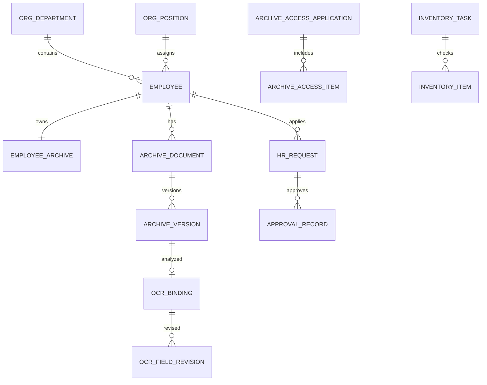

# 数据库设计（重构版）

数据库由 Flyway `V1` 到 `V6` 管理。认证和组织使用 `sys_user`、`sys_role`、`sys_user_role`、`org_department`、`org_position`、`employee`；档案链路使用 `employee_archive`、`archive_document`、`archive_version`、`file_object`；OCR 证据使用 `ocr_binding`、`ocr_field_revision`；流程使用 `hr_request`、三类 detail 表和 `approval_record`；授权与盘点使用 `archive_access_*`、`archive_use_record`、`inventory_*`、`exception_record`；所有操作进入 `operation_log`。

核心关系：

`archive_version` 追加写入并通过 `is_current` 标记当前版本；原图元数据的 SHA-256 用于去重与追溯。OCR 失败只更新绑定状态，不删除档案版本。`operation_log` 只保存动作摘要、对象和 traceId，不保存密码、原图或完整 OCR JSON。

演示迁移 `V6__demo_seed.sql` 仅生成 `DEMO-` 账号、组织、员工、档案完整率样例和流程样例，使用固定 BCrypt 示例密码。
